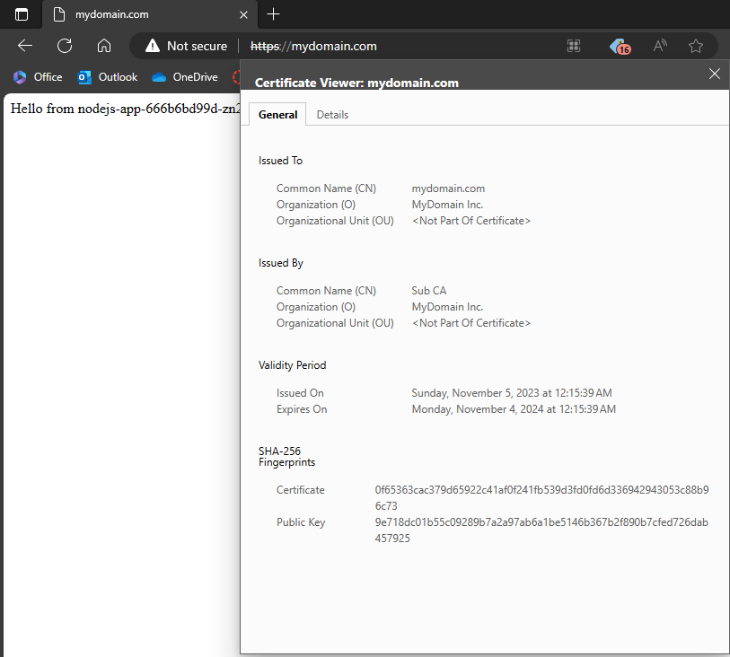

# K8s TLS Reverse Proxy (nginx)

## Intro
In this example, we illustrate the implementation of a Reverse Proxy (Ingress) using Nginx and Kubernetes. We showcase how a single custom certificate can be used to provide TLS encryption to a Node.js application through the Ingress.

Our certificate is signed by a private Certificate Authority (CA), offering a secure solution for local development and testing within a Kubernetes environment. It's important to note that this example is designed for use in local development or testing scenarios and is not recommended for production deployment.

Our Kubernetes Cluster is hosted on KinD (Kubernetes in Docker), a powerful tool that enables the creation of Kubernetes clusters within Docker containers, enhancing the portability and flexibility of your development and testing environments.

## Prerequisites
- Kubernetes Cluster
- Server TLS Certificate
- Server TLS Private Key
- Docker Engine
- Kind (Optional)

## Creating a Cluster (kind)
```shell
kind create cluster --name k8s-tls-reverse-proxy --image kindest/node:v1.23.5
```

## Container to work in
This container will help us to manage our Kubernetes cluster.

```shell
docker run -it --rm -v ${HOME}:/root/ -v ${PWD}:/work -w /work --net host alpine sh
```

Install some tools needed in the container

```shell
# install curl 
apk add --no-cache curl

# install kubectl 
curl -LO https://storage.googleapis.com/kubernetes-release/release/`curl -s https://storage.googleapis.com/kubernetes-release/release/stable.txt`/bin/linux/amd64/kubectl
chmod +x ./kubectl
mv ./kubectl /usr/local/bin/kubectl

# install helm 

curl -o /tmp/helm.tar.gz -LO https://get.helm.sh/helm-v3.10.1-linux-amd64.tar.gz
tar -C /tmp/ -zxvf /tmp/helm.tar.gz
mv /tmp/linux-amd64/helm /usr/local/bin/helm
chmod +x /usr/local/bin/helm
```

## NGINX Ingress Controller

### Get the installation YAML

```shell
helm repo add ingress-nginx https://kubernetes.github.io/ingress-nginx
helm search repo ingress-nginx --versions
```

Now we install the `helm` chart.

```shell
CHART_VERSION="4.8.0"
APP_VERSION="1.9.0"

mkdir ./manifests/

helm template ingress-nginx ingress-nginx \
--repo https://kubernetes.github.io/ingress-nginx \
--version ${CHART_VERSION} \
--namespace ingress-nginx \
> ./manifests/nginx-ingress.${APP_VERSION}.yaml
```

### Deploy the ingress controller

```shell
kubectl create namespace ingress-nginx
kubectl apply -f ./manifests/nginx-ingress.${APP_VERSION}.yaml
```

### Check the installation

For testing purposes, we will use `port-forwarding`.

```shell
kubectl -n ingress-nginx port-forward svc/ingress-nginx-controller 443
```

Or if you want to listen at any interface:
```shell
kubectl -n ingress-nginx port-forward svc/ingress-nginx-controller 443 --address='0.0.0.0'
```

Now we can reach our controller on [https://localhost/](https://localhost/).

> Note: This needs to be ran outside the Docker Container

## Features

Now is time to deploy a WebApp to test our Ingress Controller. The WebApp Source Code is in `nodejs_app/`, this simple WebApp shows the hostname where is running on.

The Docker Image is already up on Docker Hub: `missaelcorm/nodejs_app:1.0`

### Deploy nodejs_app

```shell
kubectl apply -f ./features/nodejs_app.yaml
```

Test the service: `kubectl port-forward svc/nodejs-app 80`.

Should be available at [http://localhost/](http://localhost/).

### TLS Secret

To use our Certificates we're going to use secrets.

`./features/my-tls-secret.yaml`:
```yaml
apiVersion: v1
kind: Secret
metadata:
  name:  my-tls-secret
data:
   tls.crt: BASE64_CERTIFICATE  # Replace this value
   tls.key: BASE64_PRIVATE_KEY  # Replace this value
type: kubernetes.io/tls
```

To fill the `tls.crt` and `tls.key` we are going to use the next commands:
```shell
cat <certificate_file> | base64 -w0
```
```shell
cat <private_key_file> | base64 -w0
```

And the output needs to be filled in the `my-tls-secret.yaml`

Deploy the secret:
```shell
kubectl apply -f ./features/my-tls-secret.yaml
```

### Routing by Domain
Ingress Example `./features/routing-by-domain.yaml`:
```yaml
apiVersion: networking.k8s.io/v1
kind: Ingress
metadata:
  name: nodejs-app
spec:
  ingressClassName: nginx
  tls:
    - hosts:
      - mydomain.com
      secretName: my-tls-secret
  rules:
  - host: mydomain.com
    http:
      paths:
      - path: /
        pathType: Prefix
        backend:
          service:
            name: nodejs-app
            port:
              number: 80
```
This Ingress answers when it's called using `mydomain.com` DNS Record, and redirects to the service `nodejs-app` at port `80`.

The `TLS` configuration applies to `mydomain.com` and uses the secret `my-tls-secret` where our Certificate and Private Key are stored.

> Note: We are not owner of `mydomain.com` so we're going to use `/etc/hosts` for Linux or `hosts` for Windows.

```
127.0.0.1   mydomain.com
```

Deploy our ingress:
```shell
kubectl apply -f ./features/routing-by-domain.yaml
```

Now we can access `nodejs_app` on [https://mydomain.com/](https://mydomain.com/).

### Result

This is our WebApp running on Kubernetes using an Ingress Controller with our Certificates.



## Resources
- https://github.com/marcel-dempers/docker-development-youtube-series/tree/master/kubernetes/ingress/controller/nginx
- https://www.nginx.com/blog/automating-certificate-management-in-a-kubernetes-environment/
- https://medium.com/avmconsulting-blog/how-to-secure-applications-on-kubernetes-ssl-tls-certificates-8f7f5751d788
- https://learnk8s.io/deploying-nodejs-kubernetes
- https://kind.sigs.k8s.io/docs/user/quick-start/
- https://github.com/missaelcorm/private-ca
- https://cert-manager.io/docs/configuration/ca/
- https://www.youtube.com/watch?v=hoLUigg4V18
- https://www.youtube.com/watch?v=72zYxSxifpM
- https://kubernetes.github.io/ingress-nginx/user-guide/tls/
